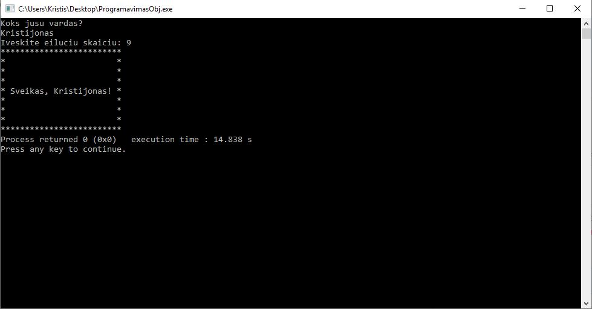

# 1 uzduotis
Programa nuskaito naudotojo vardą ir atspausdiną pasirinkto pločio sveikinimą.

# Įdiegimas
# Versijų istorija
# ***v0.1***

Pradinė programos versija. Remelio ilgis priklauso nuo įvesto vartotojo vardo, tarpų ir rėmelio ženklų. 
# ***v0.2***

Praplėsta 0.1 versija. Naudotojo lytis nustatoma pagal paskutine raidę. Jei naudotojas vyras bus spausdinama "Sveikas", jei moteris "Sveika".
# ***v0.3***
Galutinė programos versija. Eilutės saugomos struktūroje. Naudotojas rėmelio plotį gali pasirinktį savo nuožiūra.
